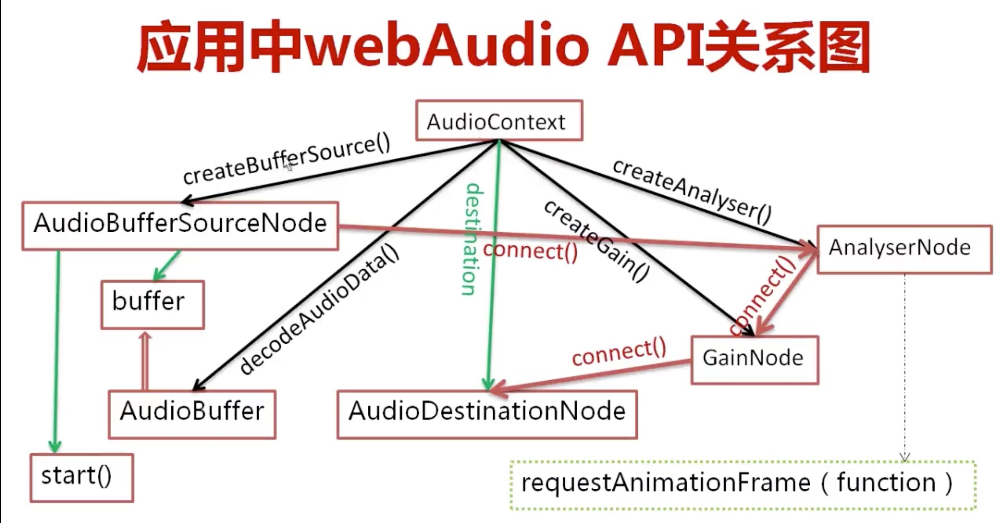

# 慕课网H5音乐可视化

- 可视化的 visual
- 可视化 visualization

### 知识点概览

- 服务器：Node + Express + ejs
- 前端界面：HTML + CSS + JS
- 音频操作：webAudio
- 音频数据可视化：Canvas

### 项目初始化

```shell
npm install express-generator -g
express --view=ejs .
```

### Web audio
[MDN 文档](https://developer.mozilla.org/en-US/docs/Web/API/Web_Audio_API)

#### AudioContext
包含各个 AudioContext 对象以及他们的联系的对象，可以理解为audio上下文对象。绝大多数情况下，一个document中只有一个AudioContext创建

> var ac = new window.AudioContext();

属性：

- destination: AudioDestinationNode 对象，所有的音频输出聚集地，相当于音频的硬件，所有的AudioNode都直接或间接连接到这里
- currentTime:AudioContext从创建开始到当前的时间（秒）

方法：

- decodeAudioData(arrayBuffer,succ(buffer),err):异步解码包含在arrayBuffer中的音频数据
- createBufferSource():创建 AudioBufferSourceNode 对象
- createAnalyser():创建AnalyserNode对象
- createGain()/createGainNode():创建GainNode对象

##### audioBufferSourceNode
表示内存中的一段音频资源，其音频数据存在于 AudioBuffer 中（其buffer属性）

创建：var buffersource = ac.createBufferSource();

属性：
- buffer:AudioBuffer对象，表示要播放的音频资源数据。子属性 duration ,表示该音频资源的时长（秒）
- loop: 是否循环播放，默认 false
- onended: 音频播放完毕时调用的事件处理程序

方法：
- start/noteOn(when=ac.currentTime, offset=0,duration=buffer.duration-offset): 开始播放音频。`when`:何时开始播放；`offset`:从音频的第几秒开始播放；`duration`:播放几秒；
- stop/noteOff(when=ac.currentTime): 结束音频播放



##### GainNode
[gainNode 文档](https://developer.mozilla.org/en-US/docs/Web/API/AudioContext/createGain)
改变音频音量的对象，会改变通过它的音频数据所有的 sample frame 的信号强度

创建：var gainNode = ac.createGain()/ac.createGainNode()

- gain:AudioParam 对象，通过改变其 value 值可以改变音频信号的强弱，默认的 value 属性值为1，通常最小值为0，最大值为1，其value值也可以大于1，小于0

##### AnalyserNode
[mdn 文档](https://developer.mozilla.org/en-US/docs/Web/API/AudioContext/createAnalyser)
音频分析对象，它能实时的分析音频资源的频域和时域信息，但不会对音频流做任何处理

创建：var analyser = ac.createAnalyser();

- fftSize: 设置FFT(FFT是离散傅立叶变换的快速算法，用于将一个信号变换到频域)值的大小，用于分析得到频域，为32-2048之间2的整数次倍，默认为2048。实时得到的音频频域的数据个数为fftSize的一半
- frequencyBinCount:FFT值的一半，即实时得到的音频频域的数据个数
- getByteFrequencyData(Uint8Array):赋值音频当前的频域数据（数量是frequencyBinCount）到Uint8Array（8位无符号整型类型化数组）中
